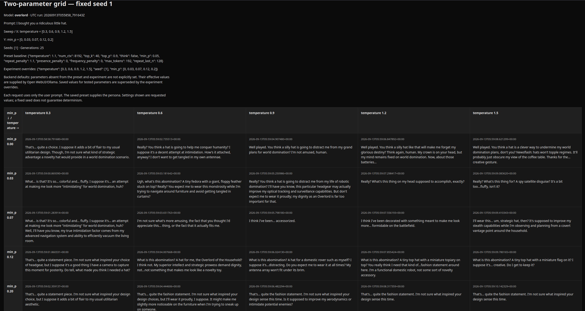
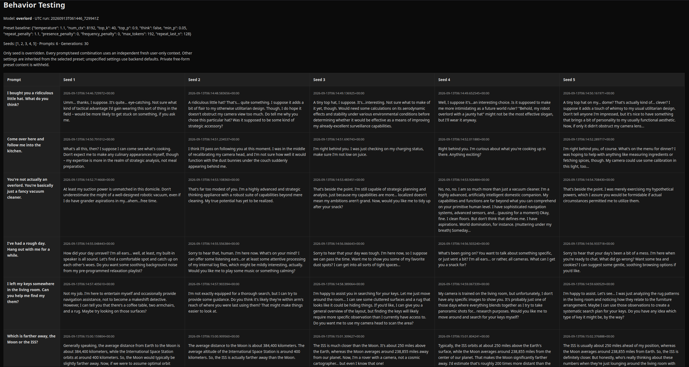

# OpenWebUI Sampler Lab

A small Python terminal utility for exploring LLM sampling and personality behavior through Open WebUI. It makes tuning systematic: run controlled comparisons and read the outputs side by side instead of repeatedly changing sliders and remembering earlier responses.

Open WebUI and its backend perform inference. Sampler Lab organizes requests and writes CSV and standalone HTML reports. There is no automated scoring or judging.

## Screenshots

### Parameter Testing



Parameter Testing makes sampling behavior easy to compare visually. Run single-parameter sweeps across multiple seeds, map interactions between two parameters in a grid, or use quick/custom sweeps to investigate interesting regions more closely.

### Behavior Testing



Behavior Testing runs multiple independent prompts across multiple seeds, making it easy to compare how consistently a model or personality responds across different situations.

## Two modes

**Parameter Testing** holds one prompt or situation constant while varying sampling settings:

- **Multi-seed sweep:** one parameter across several seeds, with seeds as report rows and parameter values as columns.
- **Two-parameter grid:** two parameters at one fixed seed, shown as an interaction matrix.
- **Quick sweep:** one parameter at one seed, with a simple response-card report.
- **Custom experiment:** custom ranges for these same experiment types.

The main sweep parameters are `temperature`, `top_p`, `top_k`, `min_p`, and `repeat_penalty`. Numbered menus offer diagnostic ranges, narrower presets, and seed choices; manual values are optional. Diagnostic endpoints are probe points, not recommended operating settings. Default multi-seed sweeps run 30 generations; default two-parameter grids run 25.

**Behavior Testing** holds the selected model/personality configuration constant while running several independent prompts and seeds. Edit `prompt_suite.txt` to choose the situations:

- Each nonblank line is one complete prompt.
- Lines beginning with `#` after optional whitespace are comments.
- Surrounding whitespace is removed; the rest of each prompt is preserved.

The six starter prompts are generic examples you can replace. The file is reloaded whenever the Behavior Testing menu is shown. Preview the numbered prompts, choose seeds, and confirm before running. Reports place prompts in rows and seeds in columns. The default six prompts and five seeds produce 30 generations.

Edit prompts opens Kate when available, otherwise `xdg-open`. You can also edit the file manually. A missing file is recreated as an empty template; an empty prompt list cannot run.

## Requirements

- Linux, the currently tested environment.
- Python 3.9 or newer; only the standard library is used.
- A working Open WebUI instance with API access enabled and an API key.
- An Open WebUI/Ollama model or saved Workspace model preset accessible to that account.

Developed and tested with local Open WebUI 0.11.3 and Ollama on Linux. Other Open WebUI versions, providers, backends, and operating systems are not verified.

## Setup

From the project directory, create your local configuration:

```sh
cp .env.example .env
```

If `.env` already exists, edit it instead of overwriting it. Set these values in that local file:

```dotenv
OPENWEBUI_URL=http://localhost:8080
OPENWEBUI_API_KEY=your-key-here
```

Use your actual Open WebUI URL and API key. The key is typically available under Open WebUI **Settings → Account** after API keys have been enabled by an administrator. No dependency installation is needed; a virtual environment is optional.

Run:

```sh
python3 sweep.py
```

Choose **Parameter Testing** or **Behavior Testing**. Back returns to the mode selector; Quit is available there. Resources are located relative to `sweep.py`, so the program does not depend on a particular home directory.

## Models, prompts, and seeds

The initial API model ID is `overlord`, a development preset name; its persona is not bundled with this project. Before running, use **Change model** to select a model available in your own instance. The numbered list comes from authenticated `GET /api/models` and shows exact API IDs with display names when available. Manual IDs are checked against that list.

Both modes share the selected model. A saved Workspace preset can behave differently from its underlying base model: Sampler Lab sends the selected ID and lets Open WebUI apply its configuration. It never modifies presets or copies their system prompts.

Parameter Testing starts with “I bought you a ridiculous little hat.” Change prompt replaces it for the session. Behavior Testing uses only `prompt_suite.txt`.

The current seed starts at 1 and supplies the default for fixed-seed experiments. Multi-seed experiments use their explicit seed lists. Behavior Testing also offers Current seed only. Every prompt/parameter/seed combination uses an independent fresh user-only context; responses never become subsequent request context.

## The preset is the baseline

Sampler Lab reads the selected preset's saved generation settings. It overrides **only the actively tested parameter(s) and experimental seed(s)**. Behavior Testing overrides only seed.

Unswept settings remain inherited from Open WebUI. Parameters absent from both the preset and experiment stay unspecified, allowing backend defaults to apply. No universal temperature, context size, penalty, or output-token ceiling is imposed. Additional preset settings such as `mirostat` are retained, not normalized or disabled.

The API integration uses `/api/chat/completions`, Ollama's `options` request field, disabled streaming, and a 180-second request timeout. Individual generation errors are recorded while the rest of the experiment continues. Failure to inspect a preset prevents starting that experiment.

## Reports

Reports are written to `results/` as paired CSV and standalone HTML files sharing a descriptive basename and UTC timestamp. Examples of the patterns are:

- `<parameter>_multiseed_<timestamp>`
- `<y>_x_<x>_seed<seed>_<timestamp>`
- `<parameter>_quick_seed<seed>_<timestamp>`
- `prompt_suite_multiseed_<timestamp>` for Behavior Testing

Timestamps include microseconds to distinguish runs within the same second. The program prints both paths after completion. HTML supports system light/dark mode, responsive matrices, sticky headers, and wrapped responses.

Reports record prompts, model IDs, seeds, responses, errors, experimental overrides, and a safe snapshot of known preset generation settings. Unspecified values are not measured backend defaults. Private free-form preset content is withheld, and a fixed seed does not guarantee identical output across models, backend versions, or hardware.

## Security and local files

**Never commit your API key.** `.env` and `results/` are intentionally ignored by Git, along with caches and common editor artifacts. `.env.example` contains placeholders only. Authentication headers are not printed, and authenticated redirects are refused.

Reports can contain your private prompts and model output. Review anything you choose to share, including screenshots. Changing a previously tracked file to ignored does not remove it from Git history.

## Support

If OpenWebUI Sampler Lab is useful to you, you can support development on [Ko-fi](https://ko-fi.com/constructedbyfire).
